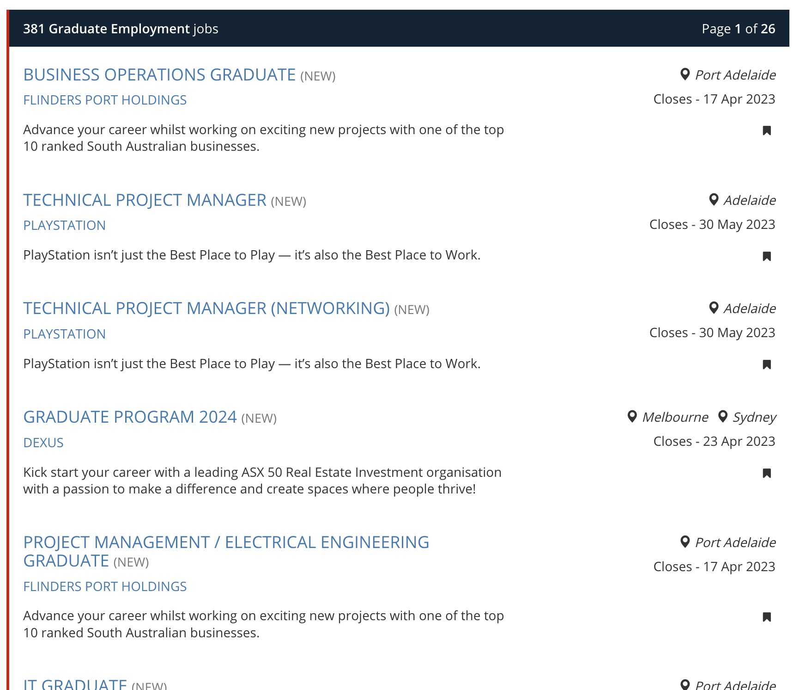
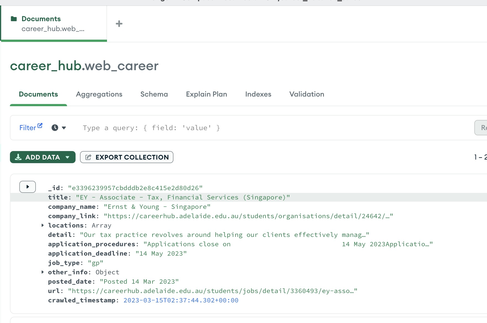

# Careerhub Scrape

This repository houses a Scrapy project that specializes in scraping job postings from the University of Adelaide Careerhub and storing the results in a MongoDB database. The project is optimized for swiftly scraping hundreds of pages in a matter of minutes and is supplemented with Docker support to facilitate setup and execution.

The spider is programmed to navigate through two primary jobs channels, namely graduate-employment and internship, in search of job detail links. Additionally, it will extract pertinent information, such as open and close dates, from the job details.


Navigation page: 


Data been scraped: 



## Table of Contents

- [Getting Started](#getting-started)
- [Docker Setup](#docker-setup)
- [Local Python Environment](#local-python-environment)
- [Running the Spider](#running-the-spider)
- [Contributing](#contributing)
- [License](#license)

## Getting Started

To get started, clone the repository:

```shell
git clone https://github.com/username/careerhub_scrape.git
```

## Docker Setup

To use Docker, ensure that you have Docker and Docker Compose installed. Build the Docker environment and start the containers with the following commands:

```shell
docker-compose build
docker-compose up
```

Alternatively, you can use the provided Makefile commands:

```shell
make build
make up
```

Create a folder of `mongodb-data/` in the root, it will be the meta data location for mongodb


## Local Python Environment

To set up a local Python environment with conda, use the provided `environment.yml` file with the following commands:

```shell
conda env create -f environment.yml
```

Alternatively, you can use the provided Makefile command:

```shell
make build_python_env
```


## Running the Spider

Because it is within university network, you must be a student of Unversity of Adelaide, and put your student id and pass with system varibles, then they will be read in the `settings.py`:

```python
# Access the SECRET_KEY environment variable
USERNAME = os.getenv("USERNAME")
PASSWORD = os.getenv("PASSWORD")
```


To start the spider, use the following command:

```shell
cd career_hub && python main.py
```

Alternatively, you can use the provided Makefile command:


```
make run
```


## Contributing

If you would like to contribute to the project, please fork the repository, make your changes, and submit a pull request.

## License

This project is licensed under the MIT License - see the [LICENSE](LICENSE)